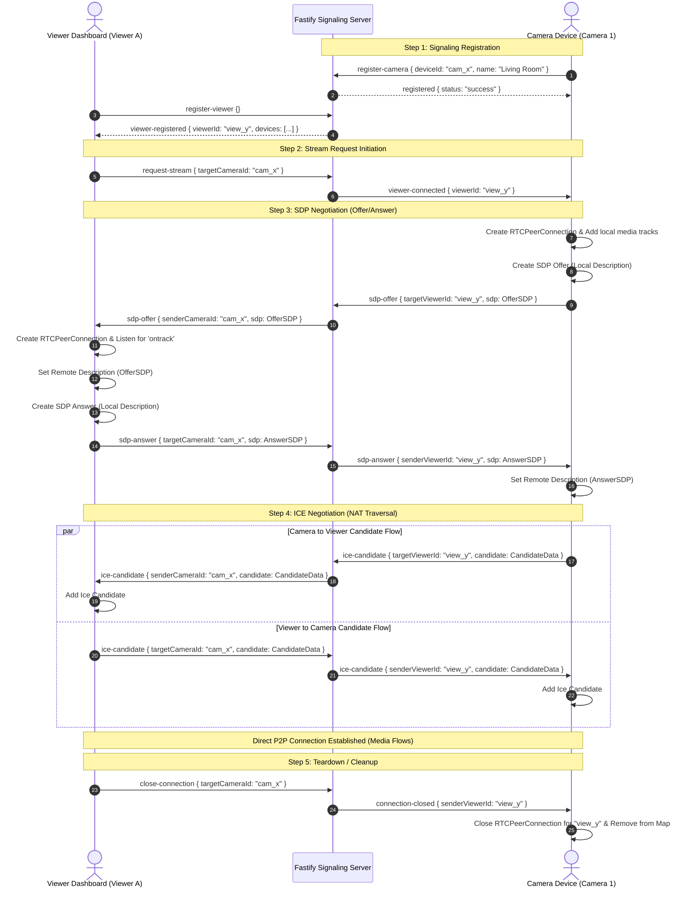

# WebRTC Connection & Multi-Stream Communication Path Guide

This document details the communication topology, signaling protocol, connection establishment flow, and connection teardown mechanisms in the **WebRTC MultiStream Application**. 

---

## 1. Architectural Overview & Network Topology

In a typical WebRTC setup, peer devices communicate **peer-to-peer (P2P)** directly without passing media (audio/video) through a central server. However, before peers can communicate directly, they must discover each other's network addresses (IP/Port) and negotiate audio/video formats. This negotiation is called **Signaling**.

Our application architecture utilizes a **three-tier topology**:
1. **Camera Device**: Captures media using `getUserMedia()`, registers itself with the signaling server, and establishes individual P2P connections to interested viewers.
2. **Signaling Server (Fastify WebSocket)**: Acts as the message broker. It stores in-memory connection registries and routes control messages (SDP offers, SDP answers, ICE candidates) between cameras and viewers.
3. **Viewer Dashboard**: Lists online cameras, requests streams, and plays the incoming P2P video/audio streams.

### High-Level Topology Diagram

```
                              +---------------------------------------+
                              |         Signaling Server              |
                              |       (Fastify / WebSocket)           |
                              +---------------------------------------+
                               /                                     \
    (WebSocket Signaling Link)/                                       \(WebSocket Signaling Link)
                             /                                         \
                            v                                           v
             +--------------------+                             +--------------------+
             |   Camera Device    |                             |  Viewer Dashboard  |
             |  (e.g., LivingRm)  |                             | (Remote Viewport)  |
             +--------------------+                             +--------------------+
                      |                                                   |
                      |                                                   |
                      +===================================================+
                                   Direct Peer-to-Peer Link
                                 (STUN / NAT Traversal / SRTP)
```

---

## 2. The Step-by-Step Connection Lifecycle

Establishing and managing a WebRTC connection involves five distinct phases:
1. **Signaling Registration**
2. **Stream Request Initiation**
3. **SDP Negotiation (Offer/Answer)**
4. **ICE Negotiation & NAT Traversal**
5. **Connection Teardown / Cleanup**

### Phase-by-Phase Connection Sequence



---

## 3. WebSocket Signaling Protocol Messages

All communication between the peers and the Fastify signaling server is packaged as JSON strings over a WebSocket channel established at `ws://<host>:<port>/ws`.

### Camera Registration
* **Sent by**: Camera Device (immediately upon starting stream preview)
* **Payload**:
  ```json
  {
    "type": "register-camera",
    "deviceId": "cam_w8vj2s9z",
    "name": "Front Porch"
  }
  ```
* **Server Action**: Registers the active WebSocket socket in memory, records/updates metadata in [devices.json](file:///e:/webrtc/devices.json), and broadcasts the updated status to all viewers.

### Viewer Registration
* **Sent by**: Viewer Dashboard (immediately on page load)
* **Payload**:
  ```json
  {
    "type": "register-viewer"
  }
  ```
* **Server Action**: Generates a random `viewerId` (UUID v4), associates it with the WebSocket connection, and sends an initial list of cameras:
  ```json
  {
    "type": "viewer-registered",
    "viewerId": "b3e34b92-7f99-4d6d-8cc1-cd974b88e1cc",
    "devices": [
      { "id": "cam_w8vj2s9z", "name": "Front Porch", "status": "online", "lastActive": "2026-06-20T12:00:00.000Z" }
    ]
  }
  ```

### Stream Request
* **Sent by**: Viewer Dashboard (when clicking "Watch Stream")
* **Payload**:
  ```json
  {
    "type": "request-stream",
    "targetCameraId": "cam_w8vj2s9z"
  }
  ```
* **Server Action**: Resolves the target camera socket and forwards a `viewer-connected` signal containing the source `viewerId` to the camera:
  ```json
  {
    "type": "viewer-connected",
    "viewerId": "b3e34b92-7f99-4d6d-8cc1-cd974b88e1cc"
  }
  ```

### SDP Offer Exchange
* **Sent by**: Camera Device (on receiving `viewer-connected`)
* **Payload**:
  ```json
  {
    "type": "sdp-offer",
    "targetViewerId": "b3e34b92-7f99-4d6d-8cc1-cd974b88e1cc",
    "sdp": "v=0\r\no=- 4209582103591745239 2 IN IP4 127.0.0.1\r\ns=-\r\nt=0 0\r\na=group:BUNDLE 0 1..."
  }
  ```
* **Server Action**: Forwards the offer to the targeted viewer as:
  ```json
  {
    "type": "sdp-offer",
    "senderCameraId": "cam_w8vj2s9z",
    "sdp": "..."
  }
  ```

### SDP Answer Exchange
* **Sent by**: Viewer Dashboard (after processing SDP Offer)
* **Payload**:
  ```json
  {
    "type": "sdp-answer",
    "targetCameraId": "cam_w8vj2s9z",
    "sdp": "v=0\r\no=- 8743209572634812034 2 IN IP4 127.0.0.1\r\ns=-\r\nt=0 0\r\na=group:BUNDLE 0 1..."
  }
  ```
* **Server Action**: Forwards the answer to the camera as:
  ```json
  {
    "type": "sdp-answer",
    "senderViewerId": "b3e34b92-7f99-4d6d-8cc1-cd974b88e1cc",
    "sdp": "..."
  }
  ```

### ICE Candidate Exchange (Bidirectional)
* **Sent by**: Camera Device or Viewer Dashboard (as ICE engine discovers local routes)
* **Payload (Camera to Viewer)**:
  ```json
  {
    "type": "ice-candidate",
    "targetViewerId": "b3e34b92-7f99-4d6d-8cc1-cd974b88e1cc",
    "candidate": {
      "candidate": "candidate:842165921 1 udp 16777215 192.168.1.15 54321 typ host...",
      "sdpMid": "0",
      "sdpMLineIndex": 0
    }
  }
  ```
* **Payload (Viewer to Camera)**:
  ```json
  {
    "type": "ice-candidate",
    "targetCameraId": "cam_w8vj2s9z",
    "candidate": { ... }
  }
  ```
* **Server Action**: Proxies the candidate payload to the target peer.

---

## 4. WebRTC Connection State Management

### 1. Multi-Viewer Routing Maps (In-Memory)
On the server side ([server.js](file:///e:/webrtc/server.js)), WebRTC channels are managed by keeping separate maps of connections:
* `cameras`: Keeps track of active camera device sockets.
* `viewers`: Keeps track of active viewer sockets.
* `socketToDevice` / `socketToViewer`: Used to perform reverse lookup upon socket closure.

This dynamic mapping structure allows a single camera socket to establish **multiple independent RTCPeerConnections** concurrently:
```
                     +---------------------------+
                     |  Camera "Front Porch"     |
                     |  (WebSocket Registration) |
                     +---------------------------+
                        /                     \
       RTCPeerConnection 1                 RTCPeerConnection 2
             (P2P)                               (P2P)
             /                                     \
            v                                       v
   +------------------+                   +------------------+
   |     Viewer A     |                   |     Viewer B     |
   | (Webcam stream)  |                   | (Webcam stream)  |
   +------------------+                   +------------------+
```

### 2. Client-Side connection maps
Inside the camera controller script ([app.js](file:///e:/webrtc/public/app.js)):
* The camera maintains `viewerConnections = new Map()` where keys are `viewerId`s and values are the associated `RTCPeerConnection` instances.
* When a camera receives a `viewer-connected` signal, it instantiates a *new* connection:
  ```javascript
  const pc = new RTCPeerConnection(iceConfig);
  viewerConnections.set(viewerId, pc);
  ```
* Local capture tracks from `localStream.getTracks()` are bound to this specific connection:
  ```javascript
  localStream.getTracks().forEach(track => pc.addTrack(track, localStream));
  ```

---

## 5. NAT Traversal & Networking Mechanics

For direct peer-to-peer connection over public routers, WebRTC uses the **ICE (Interactive Connectivity Establishment)** framework.

### STUN (Session Traversal Utilities for NAT)
Peers exist inside private Local Area Networks (LANs) with private IP addresses (e.g. `192.168.x.x`). A private IP is useless to a remote peer.
* Our app uses public STUN servers provided by Google (`stun:stun.l.google.com:19302`).
* When the ICE agent starts gathering candidates, it queries the STUN server.
* The STUN server replies back with the peer's public-facing router IP and NAT port mappings.
* The browser emits these as **srflx (Server Reflexive) ICE Candidates** which are sent via signaling.

### DTLS & SRTP
Once candidates are negotiated and a routing path is confirmed:
1. Peers perform a **DTLS (Datagram Transport Layer Security)** handshake to secure the connection and exchange keys.
2. Media channels are encrypted via **SRTP (Secure Real-time Transport Protocol)**, ensuring all direct video and audio packets are private.

---

## 6. Connection Cleanup & Tear-down Paths

To prevent memory leaks, socket congestion, and dangling webcam operations, strict cleanup routines are triggered across both WebSocket closures and WebRTC state changes.

### Scenario A: Viewer Stops Watching or Closes the Tab
```
[Viewer Dashboard] ---ws.send(close-connection)---> [Server] ---forward(connection-closed)---> [Camera]
```
1. Viewer invokes `closeRemoteStream()`.
2. It closes and nulls `remotePC`.
3. It sends a message of type `close-connection` pointing to `currentCameraId`.
4. The server forwards `connection-closed` to the camera along with the sender `viewerId`.
5. The camera receives `connection-closed`, fetches the corresponding `RTCPeerConnection` from `viewerConnections` map, calls `pc.close()`, and deletes it from the registry.

### Scenario B: Camera Stop Stream / Disconnection
1. If the camera user clicks "Stop Full Stream" or closes the tab, the camera WebSocket connection closes.
2. The server's `socket.on('close')` event catches this. It cleans up registries `cameras` and `socketToDevice`.
3. The server broadcasts a `devices-updated` message to all online viewers.
4. If a viewer is watching that camera, its `renderDevicesGrid` update or WebSocket message triggers a teardown of `remotePC`, replacing the stream viewport with the offline state indicator.
5. In addition, when a viewer disconnects, the server loops through all registered cameras and sends a `viewer-disconnected` event so that those cameras can immediately dispose of the RTCPeerConnection for that viewer.

---

## 7. Configuration Details

### ICE Servers Configuration
In [app.js](file:///e:/webrtc/public/app.js), the configuration uses Google's public servers:
```javascript
const iceConfig = {
  iceServers: [
    { urls: 'stun:stun.l.google.com:19302' },
    { urls: 'stun:stun1.l.google.com:19302' }
  ]
};
```

> [!NOTE]
> If testing across different network routers (e.g. mobile cellular connection viewing a home camera behind symmetric routers), the connection might fail. To make this production-ready, a **TURN (Traversal Using Relays around NAT)** server (such as Coturn) must be added to `iceConfig.iceServers` to relay media traffic when direct P2P connection paths are blocked.
