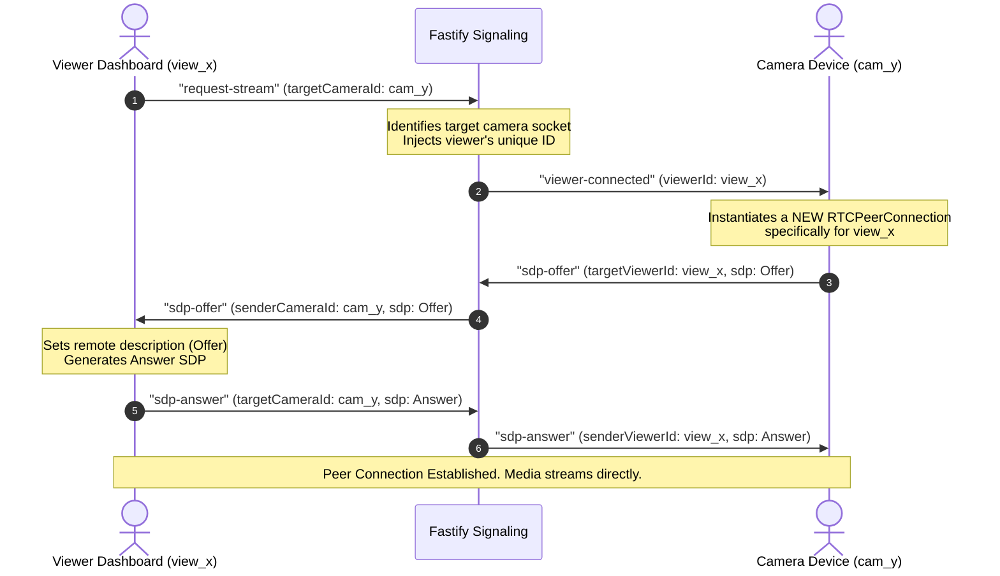

# WebRTC Communication & Multi-Device Routing Protocol

This document explains the WebRTC communication protocol, WebSocket signaling formats, and how the Fastify server handles multiple concurrent camera connections and dynamically routes streams to viewer clients.

---

## 1. WebRTC & Signaling Overview

WebRTC (Web Real-Time Communication) allows browser-to-browser peer-to-peer transmission of audio and video. However, devices cannot connect directly without first exchanging network coordinates and media capabilities. This process is called **Signaling**.

### Core Components
1. **SDP (Session Description Protocol)**: A text-based format describing the media capabilities of a device (codecs, resolutions, etc.). It is exchanged as an **Offer** and an **Answer**.
2. **ICE Candidates (Interactive Connectivity Establishment)**: Details about the network routing path (IP addresses, ports, protocol types) that peers use to discover the best way to connect to each other.
3. **STUN Server (Session Traversal Utilities for NAT)**: A lightweight public server that helps a device behind a NAT/Router discover its public IP address and port so it can share it with the other peer.
4. **Signaling Channel (WebSocket)**: The intermediary broker (our Fastify WebSocket endpoint) that forwards SDPs and ICE candidates between cameras and viewers.

---

## 2. Multi-Device Connection & Routing Topology

The architecture is designed to support **many cameras** and **many viewers** simultaneously. 

### Server-Side Data Structures
To route signaling messages to the correct destination, the server keeps three registries in memory:
* `cameras` (Map): Maps unique `deviceId` -> `{ socket, name, lastSeen }`
* `viewers` (Map): Maps unique `viewerId` -> `{ socket }`
* `socketToDevice` / `socketToViewer` (Maps): Reverse lookups to clean up when sockets disconnect.

```
       [ Camera A ]                   [ Viewer 1 ]
     (deviceId: cam_1)              (viewerId: view_1)
            \                              /
             \  (WebSocket Signaling)     /  (WebSocket Signaling)
              v                          v
        +--------------------------------------+
        |         Fastify WebSocket            |
        |              Server                  |
        +--------------------------------------+
              ^                          ^
             /                            \
            /  (WebSocket Signaling)       \  (WebSocket Signaling)
           v                                v
     [ Camera B ]                     [ Viewer 2 ]
   (deviceId: cam_2)                (viewerId: view_2)
```

---

## 3. Step-by-Step Message Flow & API Specs

Every WebSocket message is sent as a JSON string containing a `type` property.

### Path A: Camera Device Setup (Registration)
1. **Camera Page Loads**: The camera generates a unique `deviceId` (e.g., `cam_9f8a2b3c`) and saves it to `localStorage` to ensure persistence.
2. **WS Connection Opened**: The camera connects to `ws://localhost:3000/ws`.
3. **Register Camera Request**:
   * **Message Schema**:
     ```json
     {
       "type": "register-camera",
       "deviceId": "cam_9f8a2b3c",
       "name": "Warehouse Entrance"
     }
     ```
   * **Server Action**:
     * Adds the socket reference to `cameras` Map.
     * Updates `devices.json` history list.
     * Broadcasts `devices-updated` to all connected viewers.
     * Replies with success status:
       ```json
       { "type": "registered", "status": "success" }
       ```

---

### Path B: Viewer Dashboard Setup
1. **Viewer Dashboard Loads**: Fetches current device directory from `GET /api/devices` (REST fallback) and connects to `ws://localhost:3000/ws`.
2. **Register Viewer Request**:
   * **Message Schema**:
     ```json
     {
       "type": "register-viewer"
     }
     ```
   * **Server Action**:
     * Generates a random `viewerId` (UUID v4) and saves the socket in the `viewers` Map.
     * Sends back the assigned `viewerId` and the current list of devices:
       ```json
       {
         "type": "viewer-registered",
         "viewerId": "b18ca210-9831-4196-857a-0d12a67e4cd1",
         "devices": [
           { "id": "cam_9f8a2b3c", "name": "Warehouse Entrance", "status": "online", "lastActive": "2026-06-19T22:40:00Z" }
         ]
       }
       ```

---

### Path C: Initiating a Live Stream (Peer Connection Handshake)

When a viewer clicks **"Watch Stream"** for a specific camera (`cam_9f8a2b3c`), the signaling protocol dynamically handles the routing:



#### Message Schemas for Handshake:

1. **Request Stream** (Viewer -> Server):
   ```json
   {
     "type": "request-stream",
     "targetCameraId": "cam_9f8a2b3c"
   }
   ```

2. **Viewer Connected Alert** (Server -> Camera):
   ```json
   {
     "type": "viewer-connected",
     "viewerId": "b18ca210-9831-4196-857a-0d12a67e4cd1"
   }
   ```

3. **SDP Offer** (Camera -> Server):
   ```json
   {
     "type": "sdp-offer",
     "targetViewerId": "b18ca210-9831-4196-857a-0d12a67e4cd1",
     "sdp": "v=0\r\no=- 5233215286591745239 2 IN IP4 127.0.0.1..."
   }
   ```

4. **SDP Offer Forwarded** (Server -> Viewer):
   ```json
   {
     "type": "sdp-offer",
     "senderCameraId": "cam_9f8a2b3c",
     "sdp": "v=0\r\no=- 5233215286591745239 2 IN IP4 127.0.0.1..."
   }
   ```

5. **SDP Answer** (Viewer -> Server):
   ```json
   {
     "type": "sdp-answer",
     "targetCameraId": "cam_9f8a2b3c",
     "sdp": "v=0\r\no=- 12498235286591745239 2 IN IP4 127.0.0.1..."
   }
   ```

6. **SDP Answer Forwarded** (Server -> Camera):
   ```json
   {
     "type": "sdp-answer",
     "senderViewerId": "b18ca210-9831-4196-857a-0d12a67e4cd1",
     "sdp": "v=0\r\no=- 12498235286591745239 2 IN IP4 127.0.0.1..."
   }
   ```

7. **ICE Candidate Exchange** (Bidirectional):
   * *From Viewer*: `{ "type": "ice-candidate", "targetCameraId": "cam_9f8a2b3c", "candidate": {...} }`
   * *From Camera*: `{ "type": "ice-candidate", "targetViewerId": "b18ca210...", "candidate": {...} }`

---

## 4. Connection Cleanup & Tear-down Paths

To avoid memory leaks and orphan peer connections:

### Case 1: Viewer closes the stream or leaves page
1. Viewer page sends `{ "type": "close-connection", "targetCameraId": "cam_9f8a2b3c" }` to server.
2. Server forwards `{ "type": "connection-closed", "senderViewerId": "b18ca210..." }` to the targeted camera.
3. Camera looks up the specific `RTCPeerConnection` for that `viewerId`, closes it, and deletes it from its map.

### Case 2: Camera goes offline
1. Camera's WebSocket closes.
2. The server detects the closure, removes the camera from the active registry, and updates `devices.json` state to `offline`.
3. Server broadcasts a `devices-updated` message to all viewers.
4. Any viewer watching that camera will automatically display an alert and clean up their local peer connection.
